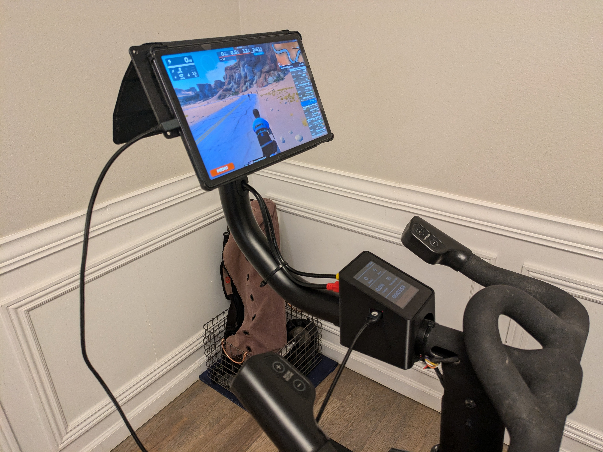
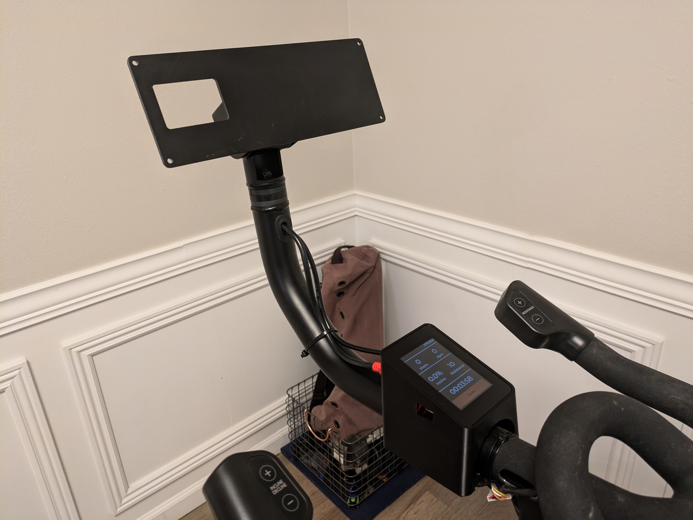
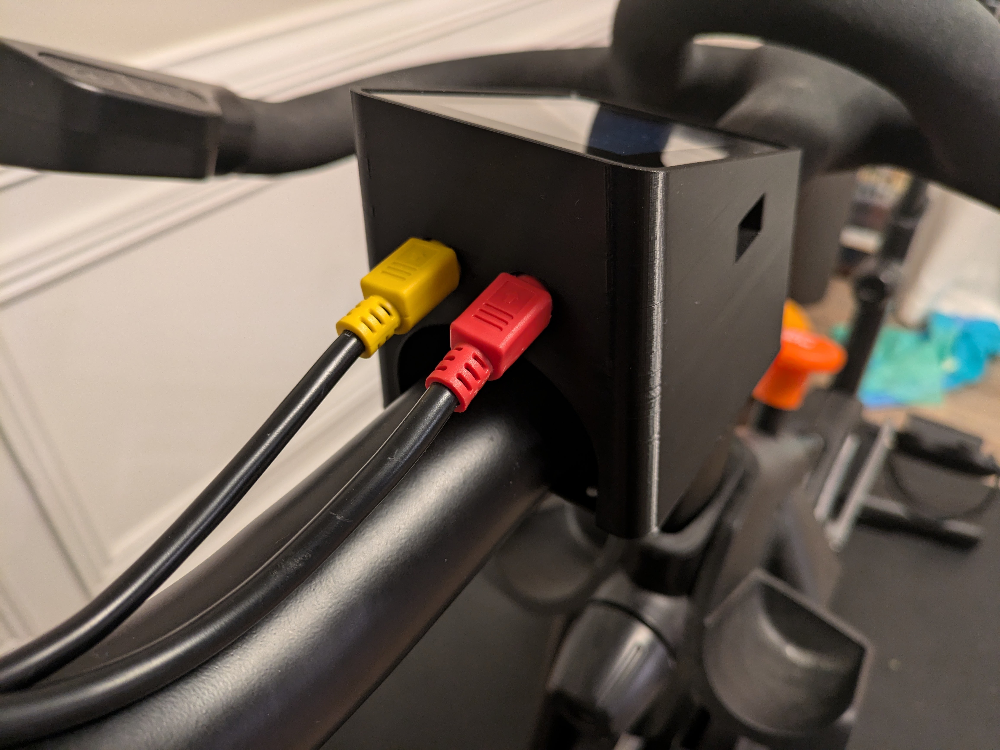
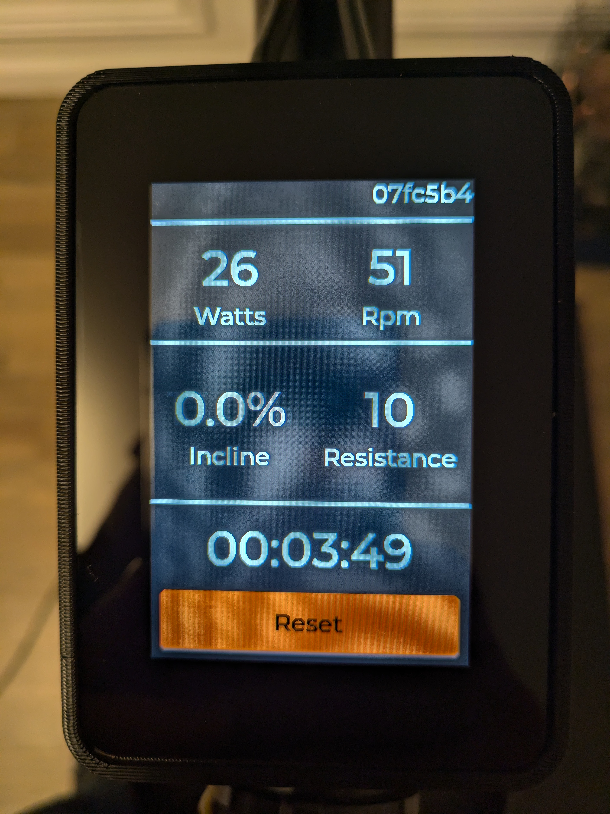
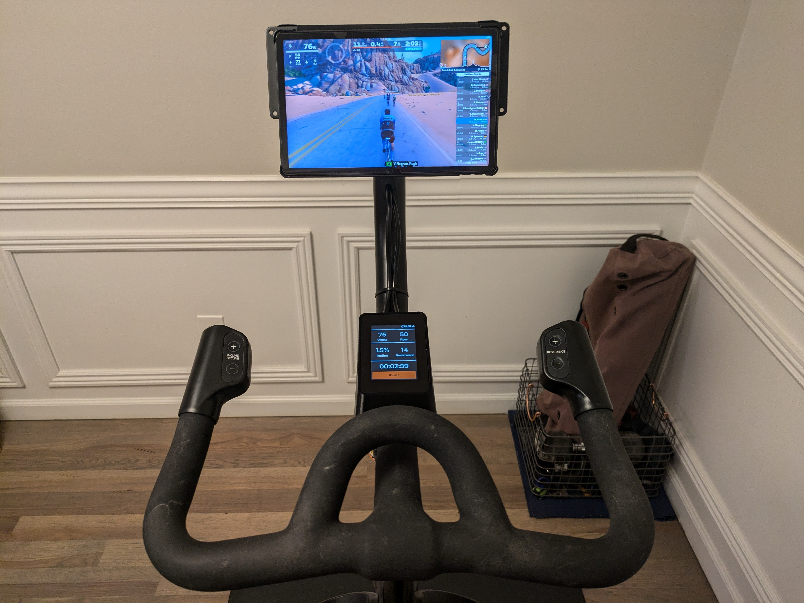
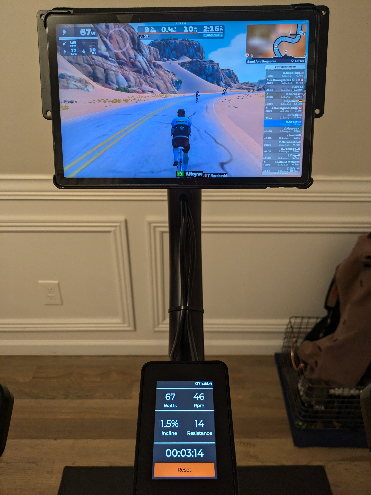
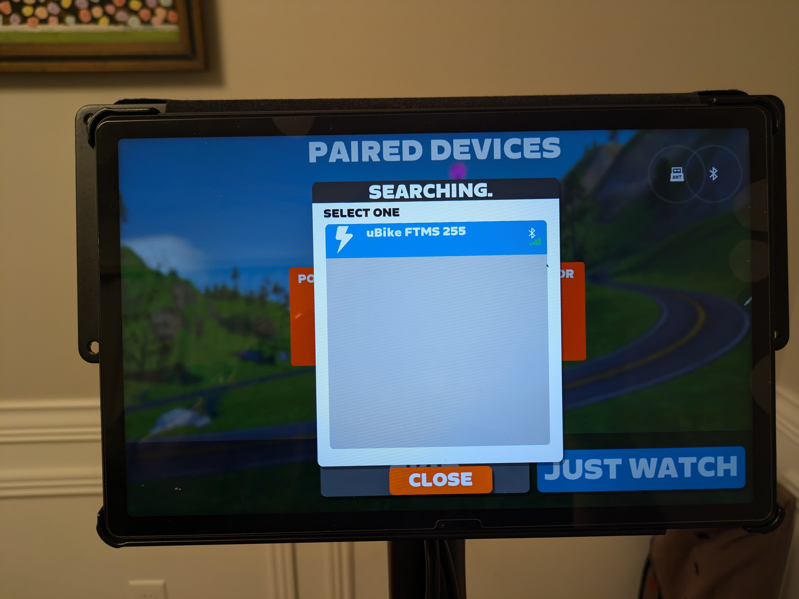
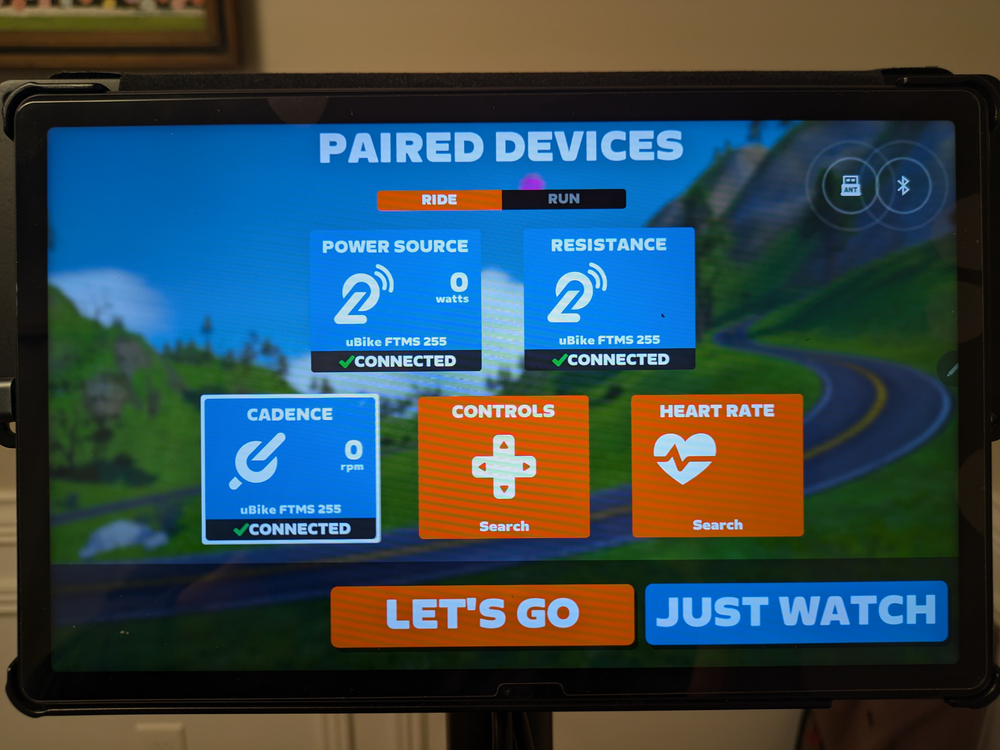

# Universal Bike Controller
The Universal Bike Controller is an open-source project aimed at providing a drop-in replacement for the factory console on NordicTrack® S-series exercise bikes (s10i, s15i, s22i, and s27i). This project allows you to upgrade and customize your bike's control system with new features and improvements.

## Explanation
The factory consoles on NordicTrack® S-series bikes may lack certain features or customization options that users desire. The Universal Bike Controller project addresses these limitations by providing an open-source solution that simplifies the hardware on the bike while unlocking connectivity to other third-party apps (Zwift®, Rouvy®, Peloton®) and smart devices.

(Tablet not included)

## Features
- Drop-in replacement controller for the iFit console
  - **Note - This controller and the OEM console cannot be used together**
- Full incline and resistance control via OEM handlebar pushbuttons
- Wireless connectivity to a variety of third-party applications
- 3.5" TFT touchscreen for reseting elapsed time
- USB Type A fast charger port for charging
- Over-the-air support for future software upgrades

## Installation
The replacement uBike console mounts in the current location of the weight tray and plugs into the same two cables as the factory console. Installation is as simple as follows:
1. Turn off the bike
1. Remove the 4 screws from the underside of the weight tray (save them) and remove the weight tray
1. Place the uBike controller in its place, with the connectors facing away from the rider
1. Use the same 4 screws removed from the weight tray to secure the uBike controller
1. Unplug the 2 cables from the factory console and plug them into the new uBike controller
  * **Please see note below on compatability if you do not have a red and yellow connector**

## Compatibility
The Universal Bike Controller is designed to be compatible with the following NordicTrack® S-series exercise bikes:
- s10i
- s15i
- s22i
- s27i

All of these versions have been tested and are working.  Additionally, since 2021 bikes have stopped shipping with the yellow and red mini-DIN connectors to the console, instead they have cables coming directly out of the console.  **If your bike does not have the red and yellow connectors** you will need to buy the cables below:
* Yellow mini-DIN-6 Connector - PN 411540 ([eBay](https://www.ebay.com/itm/255061719835)/[HydraFitness](https://hydrafitnessparts.com/collections/stationary-bike-wires-and-wire-harness/products/nordictrack-comm-s22i-s15i-s10i-stationary-bike-upper-wire-harness-411540))
* Red mini-DIN-8 Connector - PN 411536 ([eBay](https://www.ebay.com/itm/265237954787)/[HydraFitness](https://hydrafitnessparts.com/collections/stationary-bike-wires-and-wire-harness/products/nordictrack-comm-s22i-s15i-s10i-stationary-bike-extension-wire-harness-411536))

## Additional Reference Photos

## Development
Contributing to the project is encouraged and can be done by testing and reporting issues or software/hardware development.

### Hardware Overview
The hardware is composed of the following components:
* Controller PCB board
* [4D LCD 3.5" Capacitive Touch TFT-LCD](https://4dsystems.com.au/products/4dlcd-35480320-ctp-clb-ips/) 
* Controller enclosure
* Base mount for the enclosure

### Software Tools
* FreeCAD - Housing modeling
* KiCad - PCB Design
* nRF Connect 2.3.0 w/ Visual Studio Code extension - Firmware Development
* Python - Misc development and testing scripts

### Building Firmware
* Open folder `firmware/zephyr-project` in VS Code
* Open nRF Connect extension and press 'Create Build Configuration'
* Select 'ubike_v03' board
* Use defaults and press 'Build Configuration'
* Should produce a binary in `firmware/zephyr-project/build/zephyr/zephyr.hex`

### Flashing
* Open nRF Connect Programmer
* Press 'Add file' and select `firmware/zephyr-project/build/zephyr/zephyr.hex`
* Connect a [nRF52840 DK development board](https://www.nordicsemi.com/Products/Development-hardware/nRF52840-DK) or other SWD/JTAG programmer
* Select the development board as programming device
* Press 'Erase & write'

## Authors
* [@nategreco](https://github.com/nategreco)

## Need Hardware?
[Check out our store on Tindie](https://www.tindie.com/products/grecoengineer/universal-bike-controller/)

**Disclaimer**: This project is not affiliated with or endorsed by ICON Health Fitness, Inc (Nordictrack®) or its parent company. Use this software at your own risk, and be aware that modifying your exercise bike may void any warranties.

---

Contributions, feedback, and bug reports are welcome. Feel free to fork, contribute, or open issues to improve the Universal Bike Controller project!
